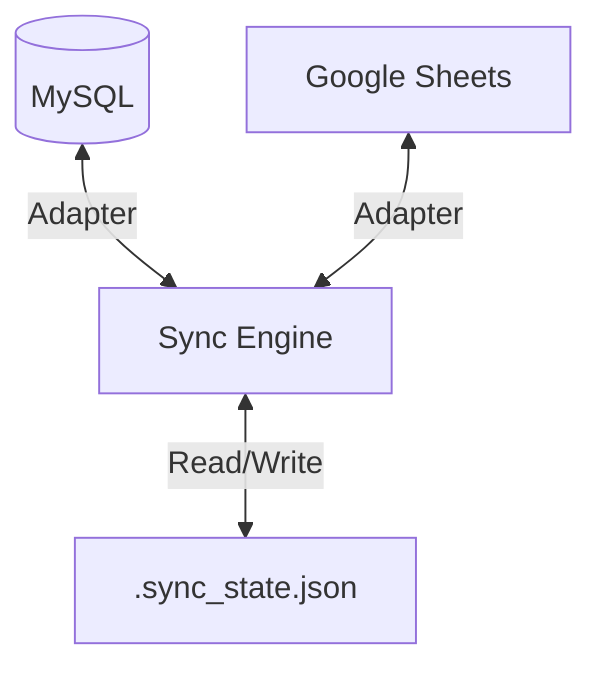

# Google Sheets <-> MySQL Bi-Directional Sync System

A production-grade synchronization engine designed to keep a MySQL database table in sync with a Google Sheet. It supports two-way data propagation, conflict resolution, and failure recovery.

---

## Features

- **Bi-Directional Sync:** Changes in Database -> Sheet, and Sheet -> Database.
- **Conflict Resolution:** Configurable strategies (`a-wins`, `b-wins`).
- **State-Based Diffing:** Uses a metadata store to detect changes efficiently and prevent infinite loops.
- **Type Safety:** Built with TypeScript.
- **Robustness:** Handles API rate limits, network failures, and basic data validation.

---

## Architecture

The system uses a **Hub-and-Spoke** architecture with a central state store.



### How it works

1.  **Fetch:** The engine pulls all records from both MySQL and Google Sheets.
2.  **Diff:** It compares the current state of each record against a locally persisted `state` (hash).
3.  **Detect:**
    - If DB changed but Sheet didn't -> Push to Sheet.
    - If Sheet changed but DB didn't -> Push to DB.
    - If both changed -> Apply Conflict Strategy (Default: DB Wins).
4.  **Commit:** Updates are applied to the target, and the `state` is updated only upon success.

---

## Prerequisites

- **Node.js** v18+
- **MySQL** Database
- **Google Cloud Service Account** with `Google Sheets API` enabled.

---

## Installation

1.  **Clone the repository:**

    ```bash
    git clone https://github.com/TuShArBhArDwA/sheet-db-sync.git
    cd sheet-db-sync
    ```

2.  **Install dependencies:**

    ```bash
    npm install
    ```

3.  **Build the project:**
    ```bash
    npm run build
    ```

---

## Configuration

Create a `config.yaml` file in the root directory.

```yaml
adapterA:
  host: "localhost"
  user: "root"
  password: "password"
  database: "prod_db"

adapterB:
  credentialsPath: "./credentials.json"
  spreadsheetId: "1BxiM..."

mapping:
  direction: "bidirectional"
  conflictStrategy: "a-wins" # Options: a-wins, b-wins

  sourceA:
    type: "mysql"
    table: "users"
    keyColumn: "id" # The Primary Key
    columns: # Database columns to sync
      - "full_name"
      - "email"
      - "status"

  sourceB:
    type: "sheets"
    range: "Sheet1!A:Z"
    keyColumn: "id" # MUST match the header in the Google Sheet
    columns: # MUST match the headers in the Google Sheet exactly
      - "full_name"
      - "email"
      - "status"
```

> **Important:** The column names in `columns` must match EXACTLY between the Database column names and the Google Sheet (Row 1) headers.

---

## Usage

Run the sync once:

```bash
npm start
```

Run in development mode (with hot reload):

```bash
npm run dev
```

---

## Failure Handling

- **Rate Limiting:** The Google Sheets adapter handles basic quotarelimits.
- **State Corruption:** If `.sync_state.json` is deleted, the system treats all records as "New" or "Modified" and will attempt to re-sync.
  - _Note:_ Without state, the engine relies on the Conflict Strategy. If `a-wins`, it will overwrite the Sheet with DB data.
- **Logs:** Logs are written to `sync.log` and stdout.

---

## Edge Cases & Limitations

1.  **Deletions:** Physical deletion is currently **disabled** for safety. Deleted rows in the DB are ignored.
2.  **Schema Changes:** If you rename a column in MySQL, you must update the config and the Sheet header.
3.  **Large Datasets:** The system fetches full datasets. Performance may degrade >50k rows.

---

## Sponsor

If you find this helpful, consider supporting me:

- **Sponsor Me:** [Buy Me a Coffee!](https://github.com/sponsors/TuShArBhArDwA)

---

## License

This project is licensed under the MIT License - see the [LICENSE](LICENSE) file for details.

---

## Contact

- **Meet T-Bot** - [Discover My Work](https://t-bot-blush.vercel.app/)
- **Tushar Bhardwaj** - [Portfolio](https://tushar-bhardwaj.vercel.app/)
- **Connect 1:1** - [Topmate](https://topmate.io/tusharbhardwaj)
- **GitHub:** [TuShArBhArDwA](https://github.com/TuShArBhArDwA)
- **LinkedIn:** [Tushar Bhardwaj](https://www.linkedin.com/in/bhardwajtushar2004/)
- **Email:** [tusharbhardwaj2617@example.com](mailto:tusharbhardwaj2617@example.com)
